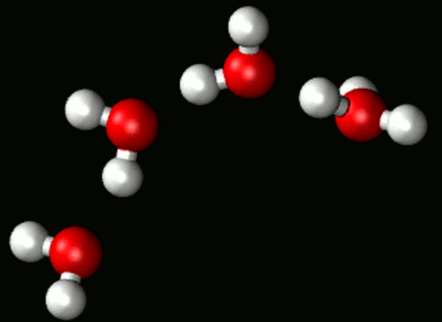
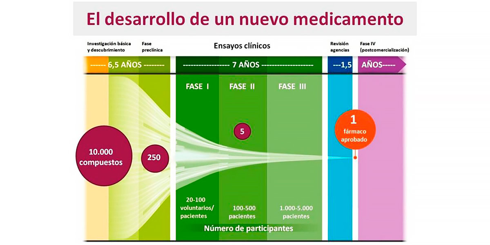
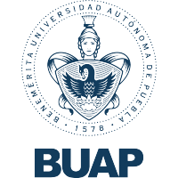

# **Los fármacos después de Lipinski**

Hace veinte años, un químico curioso y apasionado por su trabajo, revolucionó el descubrimiento de nuevos fármacos. Su nombre es **Crhistopher Lipinski** y su _Regla de los cinco_ constituye hoy en día el primer paso para evaluar el potencial de cualquier compuesto para ser procesado de manera adecuada por el cuerpo humano. 


El Dr. Lipinski es un ejemplo del poder de una persona que disfruta su profesión. En 2005 publicó  _"Advanced Drug Delivery Reviews"_, texto que se ha convertido en el texto químico más citado en la actualidad, principalmente haciendo referencia a la _Regla de los cinco_, misma que llego a la comunidad científica en este documento. 

# **Cinco, el número de la suerte**

La hoy famosa _Regla de los cinco_, establece las reglas empíricas que un fármaco debe cumplir para llegar a ser utilizado como medicina. Las reglas establecen que:
1. Debe tener un peso molecular inferior a 500 g/mol.
2. No debe tener más de cinco donadores de puentes de hidrógeno. 
3. No debe tener más de 10 aceptores de puentes de hidrógeno. 
4. Debe tener un partición octanol-agua (logP) inferior a 5.



Como se puede observar, cada regla incluye un parámetro que es múltiplo de cinco, factor que dio origen al nombre de la regla misma. Esta regla, se ha convertido en la base para la evaluación del potencial de un fármaco para convertirse en medicina. Su importancia radica en que permite diferenciar fácilmente los compuestos sin probabilidad de éxito de aquellos que son viables, lo que a su vez brinda la posibilidad de enfocar las pruebas físicas y biológicas en fármacos que el cuerpo humano es capaz de procesar y utilizar para su beneficio.


# **Evaluar para elegir, elegir para decidir**
Debido a la relevancia de la _Regla de los cinco_, hemos desarrollado un pequeño programa que permite evaluar cada factor establecido por el Dr. Lipinski. Está desarrollado en lenguaje Python, por lo que puede utilizarse fácilmente. 

## Calculadora de Factores Lipinski

```markdown

#Variable que guarda la regla de donadores de enlaces de hidrógenos
dH = input('Número de donadores de enlaces de hidrógenos: ')
dH = int(dH)
if dH <= 5:
  print('Cumple con las reglas')
else:
  print('No cumple con las reglas')

#Variable que guarda la regla de aceptores de enlaces de hidrógenos
aH = input('Número de aceptores de enlaces de hidrógenos: ')
aH = int(aH)
if aH <= 10:
  print('Cumple con las reglas')
else:
  print('No cumple con las reglas')

#Variable que guarda la regla del peso molecular
pM = input('Peso molecular en Da: ')
pM = int(pM)
if pM <= 500:
  print('Cumple con las reglas')
else:
  print('No cumple con las reglas')

#Variable que guarda el coeficiente de reparto octanol-agua
logP = input('Coeficiente de partición logP: ')
logP = int(logP)
if logP <= 5:
  print('Cumple con las reglas')
else:
   print('No cumple con las reglas')
```

Esta calculadora, pretende facilitar la evaluación del potencial de un compuesto para llegar a ser un fármaco exitoso, de acuerdo a las cualidades que el Dr. Lipinski ha identificado como indispensables para que tenga los efectos esprados en el cuerpo humano. 

[Da click aquí para acceder a la calculadora](https://colab.research.google.com/drive/1-z3ID-58RSfkSvnZbWsI0UwK33zzNT1k?usp=sharing)


# **Después de la evaluación:**
Ahora ya sabes que no cualquier molécula es candidata para convertirse potencialmente en un fármaco, al cumplir con los requisitos ya mencionados aseguras que pase un filtro, no obstante, el camino que sigue es largo porque aún con las reglas de lipinski cumplidas, la mólecula también tiene que ser: selectiva y potente modulador sobre su diana, posteriormente se evalua su administración, distribución, metabolismo y excresión, así como su toxicidad y los efectos secundarios que provocan en los diferentes organismos y finalmente pasar a realizar pruebas y ensayos clínicos que pueden tardar hasta 7 años.



# **Al final, la ciencia se toma su tiempo**
Para finalizar el paso por esta plataforma, al amable lector le queremos recordar que la ciencia no se desarrolla en un par de días, la paciencia es la mejor virtud que puede tener quién se dedica y está inmerso en el mundo científico, tampoco está demás decir que sin duda en ocasiones no encontramos lo que buscamos, que nos puede tomar muchos años buscar una respuesta que quizá no sea la que esperamos, pero al final, la ciencia se toma su tiempo para brindarte grandes satisfacciones y del mismo modo, brindarlas tu como científico al mundo entero.


Respetuosamente: Vianca y Karla


### Video

[Da click aquí para acceder a nuestro video](https://youtu.be/rmXvlBPq24Q)


### Referencias
- Chris Lipinski. Nat Rev Drug Discov 4, 184 (2005). [https://doi.org/10.1038/nrd1686](https://doi.org/10.1038/nrd1686)
- Dr. Christopher A. Lipinski. Melior Discovery. 2021. [https://www.meliordiscovery.com/christopher-lipinski/](https://www.meliordiscovery.com/christopher-lipinski/)


### Integrantes del equipo

  

                                                                        - Karla Adriana Pineda López

        Lic en Biomedicina, Instituto de Fisiología, Benemérita Universidad Autónoma de Puebla
  
                                                                          Contacto: pinedalopezkarla@gmail.com
  
  
  
- Vianca Valeria Castillejos Rincón

  Tecnológico de Monterrey
  
  Contacto: viancarincon@outlook.com

  


